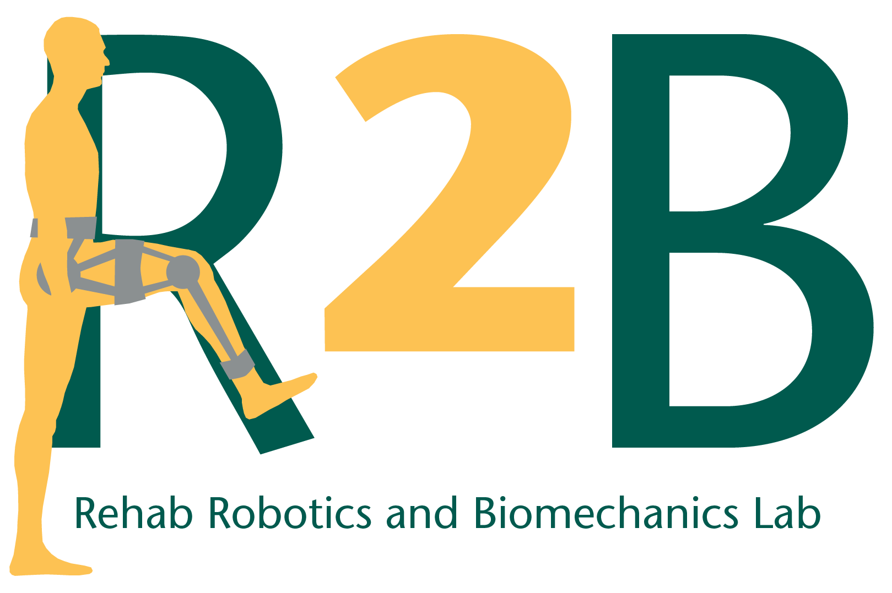

<p align="center">
  
</p>

# Vicon Data Interface

**A Real-Time Motion Capture Data Processing and Visualization System for Biomechanics Research**

[](https://www.python.org/)
[](LICENSE)
[](https://engineering.wayne.edu/)

---

## Overview

The **Vicon Data Interface** is a comprehensive software application designed to extend the capabilities of Vicon motion capture systems for biomechanics research and clinical applications. Built on top of Vicon's DataStream SDK, this interface provides real-time data acquisition, processing, visualization, and export capabilities for marker-based motion capture data and auxiliary devices (EMG, force plates, etc.).

### Key Capabilities

- **Real-Time Joint Angle Calculation**: Computes lower extremity joint angles using Plug-in Gait marker set
- **Multi-Device Integration**: Simultaneously monitors markers, EMG, force plates, and custom devices
- **Advanced Signal Processing**: Configurable filters (bandpass, moving average, moving median)
- **UDP Network Streaming**: Broadcast data to external applications for integration with other systems
- **Visual Biofeedback**: Real-time feedback display for rehabilitation and training applications
- **Flexible Data Export**: Multiple recording modes with CSV output for post-processing
- **Sample Vicon Recording for Development**: A pre-captured Vicon trial is provided so developers can build and test against the interface without requiring live access to a Vicon system

### Intended Applications

- Gait analysis and clinical biomechanics research
- Real-time biofeedback for rehabilitation
- Motion analysis for sports performance
- Integration with custom analysis pipelines
- Educational demonstrations of motion capture technology
- Development of new applications (e.g., custom games or therapy tools) that consume the interface's UDP stream
- Testing and extension of the interface itself using the included sample Vicon recording

---

## Table of Contents

- [Installation](#installation)
- [System Requirements](#system-requirements)
- [Project Structure](#project-structure)
- [Configuration](#configuration)
- [Usage](#usage)
- [Features](#features)
- [Calculated Angles](#calculated-angles)
- [Data Export Formats](#data-export-formats)
- [Sample Vicon Recording](#sample-vicon-recording)
- [Troubleshooting](#troubleshooting)
- [Authors](#authors)
- [License](#license)
- [Acknowledgments](#acknowledgments)

---

## Installation

### Prerequisites

1. **Python 3.8 or higher**
2. **Vicon DataStream SDK**
   - Download and install from [Vicon's website](https://www.vicon.com/software/datastream-sdk/)
   - Ensure the SDK is accessible to Python

### Install Dependencies

1. Clone or download this repository:
2. Install required Python packages:
   ```bash
   pip install -r requirements.txt
   ```

   **Required packages:**
   - `PySide6` (Qt6 GUI framework)
   - `numpy` (Numerical computing)
   - `pandas` (Data management)
   - `scipy` (Signal processing)
   - `pyqtgraph` (Real-time plotting)
   - `vicon-dssdk` (Vicon DataStream SDK)
   - `PyOpenGL` (Hardware-accelerated graphics)

3. Configure Vicon connection:
   - Edit `main.py` (line ~1811)
   - Update the host IP address to match your Vicon system:
     ```python
     host = "YOUR_VICON_IP:801"  # e.g., "192.168.1.100:801"
     ```

---

## System Requirements

### Hardware
- **Minimum:**
  - CPU: Intel Core i5 or equivalent
  - RAM: 8 GB
  - Network: Gigabit Ethernet
  - GPU: OpenGL 2.0 compatible

- **Recommended:**
  - CPU: Intel Core i7 or better
  - RAM: 16 GB
  - Network: Gigabit Ethernet with dedicated NIC for Vicon
  - GPU: OpenGL 3.0+ with hardware acceleration

### Software
- **Operating System:** Windows 10/11
- **Python:** 3.8, 3.9, 3.10, or 3.11
- **Vicon Nexus:** 2.12 or higher (running on Vicon PC)

### Network Configuration
- Both the Vicon PC and the application PC must be on the same network
- Firewall must allow communication on port 801 (default Vicon DataStream port)
- Recommended: Dedicated network interface for motion capture data

---

## Project Structure

```
ViconDataInterface/
├── main.py                      # Main application entry point
├── Filters.py                   # Signal filtering implementations
├── requirements.txt             # Python dependencies
├── README.md                    # This file
├── LICENSE                      # MIT license
├── .gitignore                   # Git ignore rules
├── Vicon Interface Icon.ico     # Application icon
│
├── assets/                      # Static assets (logos, images for the README/UI)
│   └── LabLogo.png              # R2B Lab logo
│
├── GUI/                         # Graphical user interface modules
│   ├── MainWindow_ui.py         # Main window UI (auto-generated)
│   ├── MainWindow.ui            # Qt Designer main window definition
│   ├── FeedbackWindow_ui.py     # Feedback window UI (auto-generated)
│   ├── FeedbackWindow.ui        # Qt Designer feedback window definition
│   ├── FeedbackGraph.py         # Biofeedback visualization widget
│   └── MyOpenGLCharting.py      # OpenGL-accelerated plotting
│
├── Kinematics/                  # Joint angle calculation modules
│   ├── Calculation.py           # Geometric calculation functions
│   └── MarkerKinematics.py      # Plug-in Gait kinematics implementation
│
├── ViconWrapper/                # Vicon DataStream SDK wrapper
│   ├── ViconWrapper.py          # Main Vicon interface class
│   ├── Subject.py               # Subject data representation
│   ├── Segment.py               # Body segment representation
│   └── Forceplate.py            # Force plate interface (experimental)
│
├── SampleData/                  # Sample Vicon recording for development/testing
│   └── (Vicon trial files — added separately, see "Sample Vicon Recording" section)
│
└── OtherFiles/                  # Miscellaneous supporting files and screenshots
```

---

## Configuration

### Before Launching the Application

#### 1. Vicon System Setup (see Vicon video resources for additional details https://www.yout-ube.com/watch?v=ooesFPKgN6Q)

1. **Launch Vicon Nexus** on the Vicon PC
2. **Create the subject and attach the labeling template** then measure and add required dimensions 
3. **Collect a static pose**
4. **Reconstruct the data in the static pose** 
5. **Label all markers** according to the Plug-in Gait marker set (note marker names must match the following):
   - Pelvis: `LASI`, `RASI`, `LPSI`, `RPSI`
   - Lower extremity: `LKNE`, `RKNE`, `LANK`, `RANK`
   - Foot: `LHEE`, `RHEE`, `LTOE`, `RTOE`
6. **Scale the subject** using the scale subject VSK
7. **Calibrate the subject** using the marker only subject calibration
8. **Process static plug-in gait model**
9. **Start live mode** in Nexus
10. **Enable DataStream** (Tools → Enable DataStream SDK)

**Note** steps 5-7 can be completed automatically using the Auto Initialize Labeling Pipeline 

#### 2. Network Configuration

1. Ensure both PCs are on the same network
2. Note the Vicon PC's IP address (visible in Nexus system settings or using ipconfig command)
3. Configure firewall to allow traffic on port 801

#### 3. Application Configuration 

Edit the configuration in `main.py` (Subject measurements can be changed in Runtime):

```python
# Vicon system IP address and port
host = "192.168.1.100:801"  # Update with your Vicon IP

# Subject anthropometric measurements (in millimeters)
vicon.subjectLLegMM = 800   # Default Left leg length 
vicon.subjectRLegMM = 800   # Default Right leg length
vicon.subjectMarkerRMM = 7  # Default Marker radius
```

### Optimizing Performance

- **Select only required data streams** to minimize processing overhead
- **Disable unused devices** in the device selection tree
- **Use appropriate filter window sizes** (larger = more smoothing, more delay)

---

## Usage

### Quick Start (Vicon is Live and Subject exist)

1. **Launch the application:**
   ```bash
   python main.py
   ```

2. **Wait for connection:** The application will automatically connect to the Vicon system if Subject exists.

3. **Select data streams:**
   - Navigate to the **Device Selection** tab
   - Double-click devices/channels to enable/disable them
   - Navigate to the **Angle Selection** tab
   - Double-click angles to enable/disable calculation

4. **Visualize data:**
   - Go to the **Plotting** tab
   - Select angles from dropdown menus
   - Choose left/right side
   - Select device data if desired
   - Adjust Y-axis range using sliders

5. **Record data:**
   - Go to the **Exporting** tab
   - Set file path and name
   - Click "Start Recording" or "Record Duration"

### Advanced Features

#### Real-Time Filtering

1. Navigate to **Angle Selection** → **Filters**
2. Select filter type:
   - **None**: No filtering (lowest latency)
   - **Bandpass**: Remove specific frequency ranges
   - **Moving Average**: Smooth high-frequency noise
   - **Moving Median**: Remove spikes and outliers
3. Configure filter parameters
4. Filter is applied immediately to all angle calculations

#### UDP Streaming

1. Go to **Streaming** tab
2. Enter target IP address and port
3. Configure packet format:
   - **Packet Size**: Total packet character length 
   - **Value Size**: Space allocated for numerical value
4. Select data to stream from the table
5. Click "Start Stream"

**Packet Format:**
```
[Label (variable) | Padding (spaces) | Value (fixed) | '$']
Example: "LHip          45.67     $"
```

#### Visual Biofeedback

1. Open the **Feedback** window (separate window)
2. In main window, go to **Feedback** tab
3. Select one angle or device measurement
4. Configure feedback ranges:
   - **Total Range**: Full display range
   - **Target Region**: Desired performance zone
   - **Option to Negate the Feedback Signal**
5. Monitor in real-time on feedback window

---

## Features

### Data Acquisition

- **Device Integration**: EMG, force plates, accelerometers, custom analog devices
- **Multi-Rate Sampling**: Handles devices with different sampling rates
- **Frame Synchronization**: Automatic synchronization of all data sources

### Joint Angle Calculation

- **Real-Time Computation**: Joint angles calculated each frame (~100 Hz in
  live mode; lower when Nexus is in recording-playback mode, since the SDK
  is throttled by the playback engine)
- **Plug-in Gait Model**: Industry-standard biomechanical model
- **Bilateral Analysis**: Simultaneous left and right side calculations
- **Zero Calibration**: Set reference position for relative measurements

### Signal Processing

- **Bandpass Filter**: FIR filter with configurable cutoff frequencies
- **Moving Average**: Simple temporal averaging (configurable window)
- **Moving Median**: Robust outlier rejection (configurable window)
- **Kalman Filter**: State estimation for prediction (experimental, not tested)

### Visualization

- **OpenGL Acceleration**: Hardware-accelerated real-time plotting
- **Multi-Series Display**: Up to 2 angles + 1 device simultaneously
- **Configurable Axes**: Custom or auto-scaling ranges
- **High Performance**: Maintains 60+ FPS with 1000-frame windows

### Data Export

Three recording modes:

1. **Manual Mode**: User-controlled start/stop
2. **Duration Mode**: Automatically record for specified time
3. **Window Mode**: Save current plot window contents

**Export Format:**
- CSV files with timestamps
- Separate files for angles and each device
- Configurable filename and auto-incrementing

### UDP Streaming

- **Low Latency**: Real-time data broadcast over network
- **Custom Packet Format**: Configurable size and structure
- **Selective Streaming**: Choose which data to transmit

---

## Calculated Angles

### Sagittal Plane (Flexion/Extension) (VALIDATED)

| Angle | Description | Positive Direction |
|-------|-------------|-------------------|
| **Hip** | Hip flexion/extension | Flexion (forward) |
| **Knee** | Knee flexion/extension | Flexion |
| **Ankle** | Ankle dorsi/plantarflexion | Dorsiflexion |

### Frontal Plane (Abduction/Adduction) (VALIDATED)

| Angle | Description | Positive Direction |
|-------|-------------|-------------------|
| **Hip Adduction** | Hip ad/abduction | Adduction (toward midline) |

### Transverse Plane (Rotation) (NOT VALIDATED)

| Angle | Description | Positive Direction |
|-------|-------------|-------------------|
| **Hip Inversion** | Hip internal/external rotation | Internal rotation |
| **Subtalar** | Foot inversion/eversion | Eversion |

### Calculation Methods

- **Hip Joint Centers**: Calculated using regression equations based on pelvic dimensions
- **Reference Frame**: Pelvis coordinate system (right-anterior-superior)
- **Angle Convention**: Right-hand rule, anatomical zero position
- **Range**: -180° to +180° (full rotation capability)

---

## Data Export Formats

### Angle Data (`*_angles.csv`)

```csv
Frame,LHip,RHip,LKnee,RKnee,LAnkle,RAnkle,LHipAdduction,RHipAdduction,...
0,12.34,15.67,45.23,43.12,8.90,7.65,5.43,4.32,...
1,13.45,16.78,46.34,44.23,9.01,8.76,5.54,4.43,...
...
```

### Device Data (`*_<device>_<channel>.csv`)

**Standard Mode** (last sample per frame):
```csv
Frame,X,Y,Z
0,123.45,234.56,345.67
1,124.56,235.67,346.78
...
```

**All Data Mode** (all samples per frame):
```csv
Frame,X,Y,Z
0.0,123.45,234.56,345.67
0.1,123.50,234.60,345.70
0.2,123.55,234.65,345.75
...
1.0,124.56,235.67,346.78
...
```

---

## Sample Vicon Recording

To make it easier for new contributors, students, and external developers to work with this interface **without needing live access to a Vicon system**, the repository ships with a sample Vicon recording in the `SampleData/` directory.

> **Note:** The Vicon recording is not yet bundled with this commit and will be added to the repository in a separate update. Once available, it will live under `SampleData/` and follow the structure described below.

### What's Included

The sample recording contains a Plug-in Gait labeled trial collected in the R2B Lab, including:

- A labeled marker set matching the names expected by the interface (`LASI`, `RASI`, `LPSI`, `RPSI`, `LKNE`, `RKNE`, `LANK`, `RANK`, `LHEE`, `RHEE`, `LTOE`, `RTOE`)
- A scaled and calibrated subject (VSK)
- Auxiliary device data (where applicable, e.g., EMG / force plates)

### Intended Uses

- **Develop applications on top of the interface** — for example, custom games, exergames, or therapy/training tools that consume the UDP stream produced by this software
- **Test and extend the interface itself** — debug new features, validate filter behavior, or experiment with additional joint-angle calculations against known data
- **Reproduce results** — replay the recording to compare outputs across software versions

### How to Use the Recording

1. Open the trial in **Vicon Nexus** on a machine with Nexus installed
2. Place Nexus in **live playback / replay mode** so the DataStream SDK serves the recorded frames as if they were live
3. Enable the DataStream SDK (**Tools → Enable DataStream SDK**)
4. Update the `host` IP in `main.py` to point at the Nexus machine (or `127.0.0.1:801` if running locally)
5. Launch the interface: `python main.py`

The application will treat the replayed trial exactly like a live capture, so all features (angle calculation, filtering, plotting, UDP streaming, recording, biofeedback) can be exercised end-to-end without a physical motion capture setup.

> **Important — playback throttles the frame rate.** When Nexus is in
> recording-playback / replay mode, the DataStream SDK is rate-limited by
> the Nexus playback engine, so the interface (and any UDP-streamed data)
> will run noticeably slower than the native 100 Hz capture rate. This is
> a Nexus-side limitation, not an issue with the interface itself.
>
> To obtain the full 100 frames-per-second pipeline (matching the rate at
> which the trial was originally recorded), Nexus must be in **live mode**
> with the cameras streaming. Use playback for development, debugging, and
> end-to-end testing; switch to live mode whenever throughput, latency, or
> real-time behavior is being measured or demonstrated.

---

## Troubleshooting

### Connection Issues

**Problem:** "Cannot connect to Vicon system"

**Solutions:**
- Verify Vicon Nexus is running and in live mode
- Check IP address in `main.py` matches Vicon PC
- Ensure DataStream SDK is enabled in Nexus
- Test network connectivity: `ping <vicon-ip>`
- Check firewall settings (port 801)

### Performance Issues

**Problem:** Low FPS or lag in visualization

**Solutions:**
- **Check that Nexus is in live mode, not playback / replay.** The DataStream
  SDK throttles output during recording playback, so the interface and any
  UDP-streamed data will run below the native 100 Hz rate. Live capture is
  required to hit the full 100 frames per second.
- Disable unused devices and angles
- Reduce plot window size (frames displayed)
- Close other applications
- Update graphics drivers
- Use a dedicated network interface for Vicon

### Missing Data

**Problem:** Markers or angles showing as zero

**Solutions:**
- Verify markers are labeled in Nexus
- Check marker names match expected names (case-sensitive)
- Ensure subject is in Nexus capture volume
- Verify markers are visible to cameras
- Check marker occlusion in Nexus

### Filter Artifacts

**Problem:** Angles look noisy or have strange behavior

**Solutions:**
- Increase filter window size for more smoothing
- Use moving median filter for spike removal
- Adjust bandpass cutoff frequencies
- Consider marker placement quality
- Check for marker swapping in Nexus

### Export Issues

**Problem:** Cannot save files or files are empty

**Solutions:**
- Verify save path exists and is writable
- Check disk space
- Ensure recording was started before data collection
- Verify selected angles/devices are active
- Close files if already open in another program

---

## Authors

**Daniil Grubich**
- Institution: Wayne State University
- Laboratory: Robotics and Biomechanics (R2B) Lab
- Email: daniil.grubich@wayne.edu

**Principal Investigator:**
- Dr. E. Peter Washabaugh
- Wayne State University, Department of Biomedical Engineering

---

## License

This project is licensed under the MIT License - see the [LICENSE](LICENSE) file for details.

```
MIT License

Copyright (c) 2024 Daniil Grubich, Wayne State University

Permission is hereby granted, free of charge, to any person obtaining a copy
of this software and associated documentation files (the "Software"), to deal
in the Software without restriction, including without limitation the rights
to use, copy, modify, merge, publish, distribute, sublicense, and/or sell
copies of the Software, and to permit persons to whom the Software is
furnished to do so, subject to the following conditions:

The above copyright notice and this permission notice shall be included in all
copies or substantial portions of the Software.

THE SOFTWARE IS PROVIDED "AS IS", WITHOUT WARRANTY OF ANY KIND, EXPRESS OR
IMPLIED, INCLUDING BUT NOT LIMITED TO THE WARRANTIES OF MERCHANTABILITY,
FITNESS FOR A PARTICULAR PURPOSE AND NONINFRINGEMENT.
```

---

## Acknowledgments

- **Vicon Motion Systems** for the DataStream SDK and technical support
- **Wayne State University** College of Engineering for facilities and resources
- **R2B Lab** members for testing and feedback
- **Open-source community** for the excellent Python libraries used in this project


---

## Contributing

We welcome contributions! If you'd like to contribute:

1. Fork the repository
2. Create a feature branch (`git checkout -b feature/YourFeature`)
3. Commit your changes (`git commit -m 'Add YourFeature'`)
4. Push to the branch (`git push origin feature/YourFeature`)
5. Open a Pull Request

### Development Guidelines

- Follow PEP 8 style guidelines
- Add docstrings to all functions and classes
- Include unit tests for new features
- Update documentation as needed

---

## Support

For questions, issues, or suggestions:

- **Email:** daniil.grubich@wayne.edu
- **Issues:** Open an issue on the GitHub repository

---

## Version History

### Version 1.0.0 (2024)
- Initial release
- Real-time marker tracking and joint angle calculation
- UDP streaming capability
- Data export in multiple modes
- Visual biofeedback system
- Configurable signal filtering

### Version 1.1.0 (2026)
- Hip adduction added to the validated joint-angle set (consistent with published validation)
- Added `SampleData/` directory and documentation for a sample Vicon recording, enabling development and testing of the interface without live Vicon hardware
- Project structure documentation cleaned up for consistency with the actual repository contents

---

**Last Updated:** April 2026

